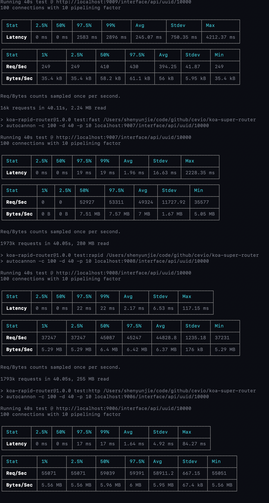
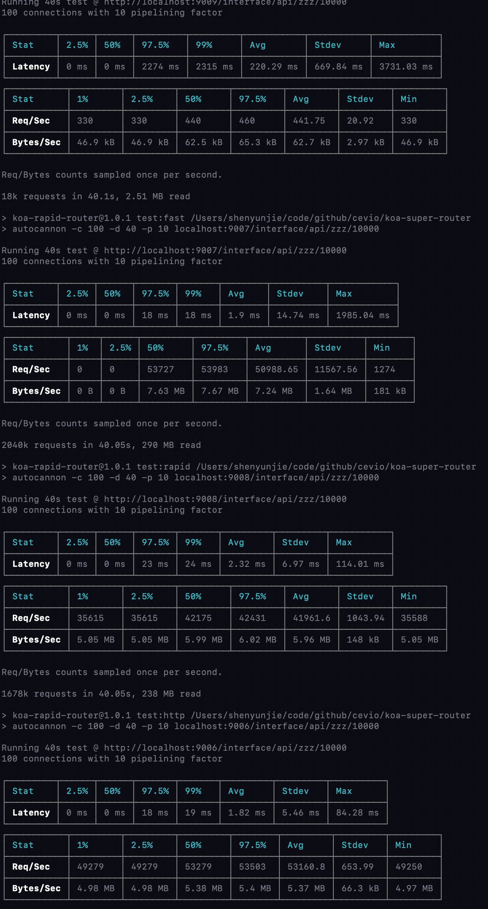

# koa-rapid-router

It is a routing architecture suitable for any service, and we usually use it on KOA, this is currently the fastest routing architecture.

## Install

```bash
npm i koa-rapid-router
```

## Document

[Get started](./docs/README.md)

## Usage in koa

```javascript
const Koa = require('koa');
const Router = require('koa-rapid-router');
const app = new Koa();
const route = new Router();
const router = route.create('/interface/api');
router.get('/uuid/{uid:number}', async (ctx) => {
  ctx.body = ctx.params.uid;
});
app.use(route.Koa()).listen(3000, err => {
  if (err) throw err;
  console.log('app run at 3000');
});
```

## Add your own types

```javascript
route.expression('xyz', '[x-z]+');
// then you can use it like this
router.get('/uuid/{uid:xyz}', async (ctx) => {
  ctx.body = ctx.params.uid;
});
```

## Performance

Its performance is 100 times faster then [koa-router](https://www.npmjs.com/package/koa-router), but it's similar to [fastify](https://www.npmjs.com/package/fastify) (if you don't use the KOA infrastructure, use http). Test sample: 10,000 static routes are injected into different architectures. The test commands are the same: `autocannon -c 100 -d 40 -p 10 <url>`

### Using static Router

```javascript
for (let i = 0; i < 10000; i++) {
  router.get('/uuid/' + (i + 1), async (ctx) => ctx.body = 'ok');
  vrouter.get('/uuid/' + (i + 1), (res) => res.end('ok'));
  route_2.get('/interface/api/uuid/' + (i + 1), async (ctx) => ctx.body = 'ok');
  fastify.get('/interface/api/uuid/' + (i + 1), (request, reply) => reply.send('ok'));
}
```

*Preview:*



*Results*

| command | architecture | Latency | Req/Sec | Bytes/Sec |
| :-----: | :----------: | :-----: | :-----: | :-------: |
| **test:koa** | `koa + koa-router` | 245.07 ms | 394.25 | 56 kB |
| **test:fast** | `fastify` | 1.96 ms | 49324 | **7 MB** |
| **test:rapid** | `koa + koa-rapid-router` | 2.17 ms | 44828.8 | 6.37 MB |
| **test:http** | `http + koa-rapid-router` | **1.64 ms** | **58911.2** | 5.95 MB |

### Using Dynamic Router

```javascript
router.get('/zzz/{a:number}', async (ctx) => ctx.body = 'ok');
vrouter.get('/zzz/{a:number}', (res) => res.end('ok'));
route_2.get('/interface/api/zzz/:a(\\d+)', async (ctx) => ctx.body = 'ok');
fastify.get('/interface/api/zzz/:a', (request, reply) => reply.send('ok'));
```

*Preview:*



*Results*

| command | architecture | Latency | Req/Sec | Bytes/Sec |
| :-----: | :----------: | :-----: | :-----: | :-------: |
| **test:koa** | `koa + koa-router` | 220.29 ms | 441.75 | 62.7 kB |
| **test:fast** | `fastify` | 1.9 ms | 50988.65 | **7.24 MB** |
| **test:rapid** | `koa + koa-rapid-router` | 2.32 ms | 41961.6 | 5.96 MB |
| **test:http** | `http + koa-rapid-router` | **1.82 ms** | **53160.8** | 5.37 MB |

### Result

It is clear from the data that the performance advantages of the service can be established through `http + koa-rapid-router`. And `fastify`, the fastest route, has been completely defeated by `rapid-router`.

Data tells us that KOA architecture performance is very poor, we are fully possible to achieve near native HTTP performance routing, as long as we continue to explore the factors affecting performance, we will be able to close to native performance. It's the same as the principle of approaching the speed of light. It's impossible to be equal, but it's approachable.

### How to test?

First open a new command line:

```bash
npm run dev
```

Then, open a new command line

```bash
npm run test
```

You can see a very shocking result.

## License

[MIT](http://opensource.org/licenses/MIT)

Copyright (c) 2018-present, yunjie (Evio) shen